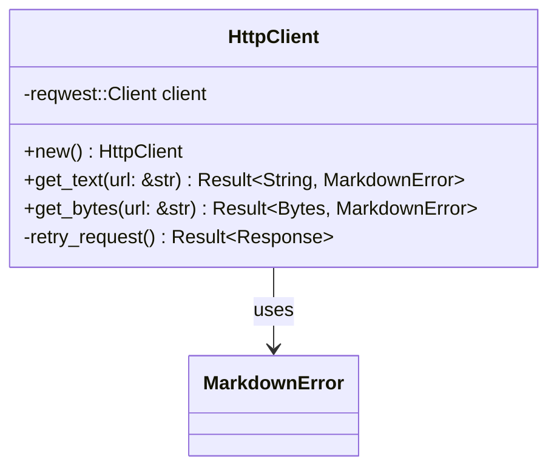

# Dependencies and HTTP Client Setup

Configure all necessary dependencies and create a robust HTTP client wrapper for fetching web content.

## Objectives

- Add all required dependencies to Cargo.toml
- Create an HTTP client wrapper with proper error handling
- Implement retry logic and timeout handling
- Add user agent configuration for web scraping

## Tasks

1. Update `Cargo.toml` with dependencies:
   - `reqwest` with features: `["json", "stream"]`
   - `html2text` for HTML to markdown conversion
   - `serde` with features: `["derive"]` 
   - `serde_yaml` for frontmatter serialization
   - `chrono` with features: `["serde"]` for timestamps
   - `tokio` with features: `["full"]` for async runtime
   - `anyhow` for error handling
   - `url` for URL parsing and validation

2. Create `src/client.rs` module with:
   - `HttpClient` struct wrapping reqwest::Client
   - Configuration for timeouts, redirects, user agent
   - Retry logic for transient failures
   - Response validation and error mapping

3. Create `src/client.rs` methods:
   - `new()` - Create client with sensible defaults
   - `get_text(url: &str) -> Result<String, MarkdownError>` 
   - `get_bytes(url: &str) -> Result<Bytes, MarkdownError>`
   - Private helper methods for retry logic

4. Add proper error mapping from reqwest errors to `MarkdownError`

## Acceptance Criteria

- [ ] All dependencies compile without conflicts
- [ ] HTTP client can fetch text and binary content
- [ ] Proper error handling for network failures
- [ ] Timeout and retry logic works correctly
- [ ] User agent string identifies the library
- [ ] Unit tests for client functionality (using mock servers)

## Dependencies

- Previous: [000002_core_types]
- Requires: Core types for error handling

## Architecture Notes

## Configuration

Default HTTP client settings:
- Timeout: 30 seconds
- Max redirects: 10
- User agent: "markdowndown/0.1.0"
- Retry policy: 3 attempts with exponential backoff