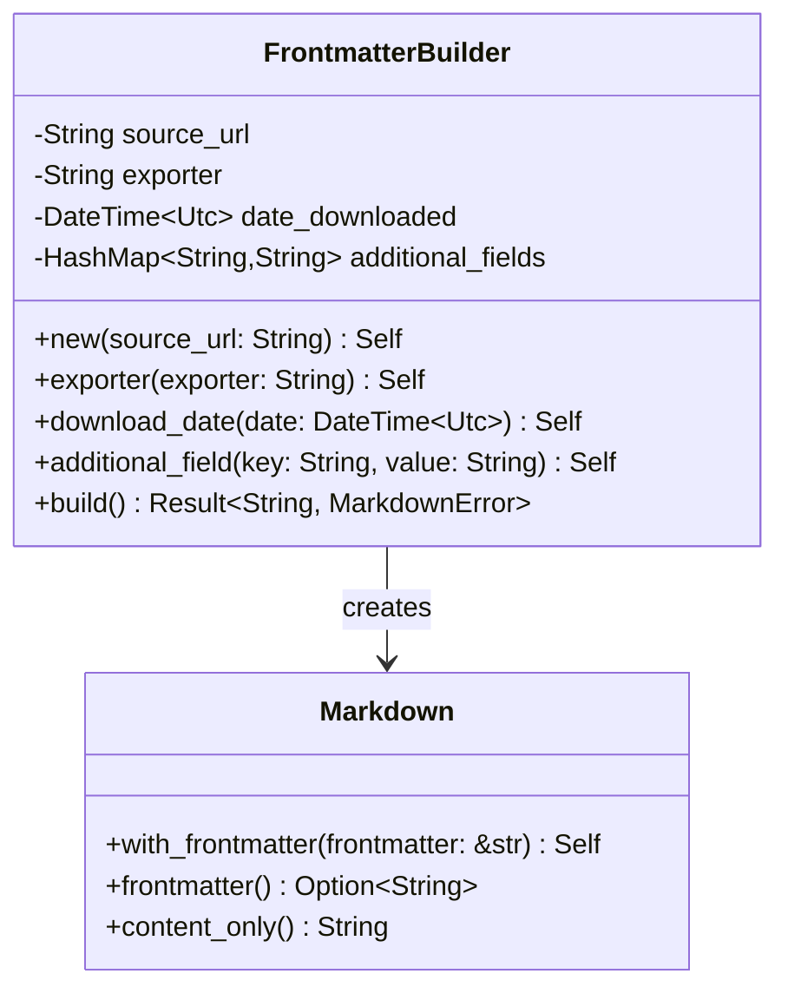

# YAML Frontmatter Generation

Implement YAML frontmatter generation for all markdown output with metadata about source URL, processing method, and timestamps.

## Objectives

- Generate consistent YAML frontmatter for all markdown output
- Include required metadata fields as specified
- Ensure proper YAML formatting and escaping
- Make frontmatter easily parseable by downstream tools

## Tasks

1. Create `src/frontmatter.rs` module with:
   - `FrontmatterBuilder` for constructing frontmatter
   - Methods to add metadata fields
   - YAML serialization functionality

2. Implement `FrontmatterBuilder` methods:
   - `new(source_url: String) -> Self` - Initialize with source URL
   - `exporter(exporter: String) -> Self` - Set exporter/processor name
   - `download_date(date: DateTime<Utc>) -> Self` - Set download timestamp  
   - `additional_field(key: String, value: String) -> Self` - Add custom fields
   - `build() -> Result<String, MarkdownError>` - Generate YAML frontmatter

3. Add frontmatter formatting:
   - Proper YAML block delimiters (`---`)
   - Correct field ordering (source_url, exporter, date_downloaded)
   - URL escaping and validation
   - ISO 8601 timestamp formatting

4. Create helper functions:
   - `combine_frontmatter_and_content(frontmatter: &str, content: &str) -> String`
   - `extract_frontmatter(markdown: &str) -> Option<Frontmatter>`
   - `strip_frontmatter(markdown: &str) -> String`

5. Integration with `Markdown` type:
   - Add `with_frontmatter()` method to Markdown
   - Add `frontmatter()` getter method
   - Add `content_only()` method

## Acceptance Criteria

- [ ] YAML frontmatter is properly formatted and valid
- [ ] All required fields are included (source_url, exporter, date_downloaded)
- [ ] URLs are properly escaped in YAML
- [ ] Timestamps use ISO 8601 format
- [ ] Frontmatter can be parsed back into struct
- [ ] Integration with Markdown type works correctly
- [ ] Unit tests for all frontmatter operations

## Dependencies

- Previous: [000004_html_conversion]
- Requires: Core types, serde_yaml dependency

## Architecture Notes



## Example Output

```yaml
---
source_url: "https://example.com/page.html"
exporter: "html2markdown"
date_downloaded: "2024-01-15T10:30:00Z"
---

# Page Title

Page content here...
```

## Test Cases

- Basic frontmatter generation
- URL escaping (special characters, unicode)
- Timestamp formatting validation
- Roundtrip serialization/deserialization
- Integration with different converter types