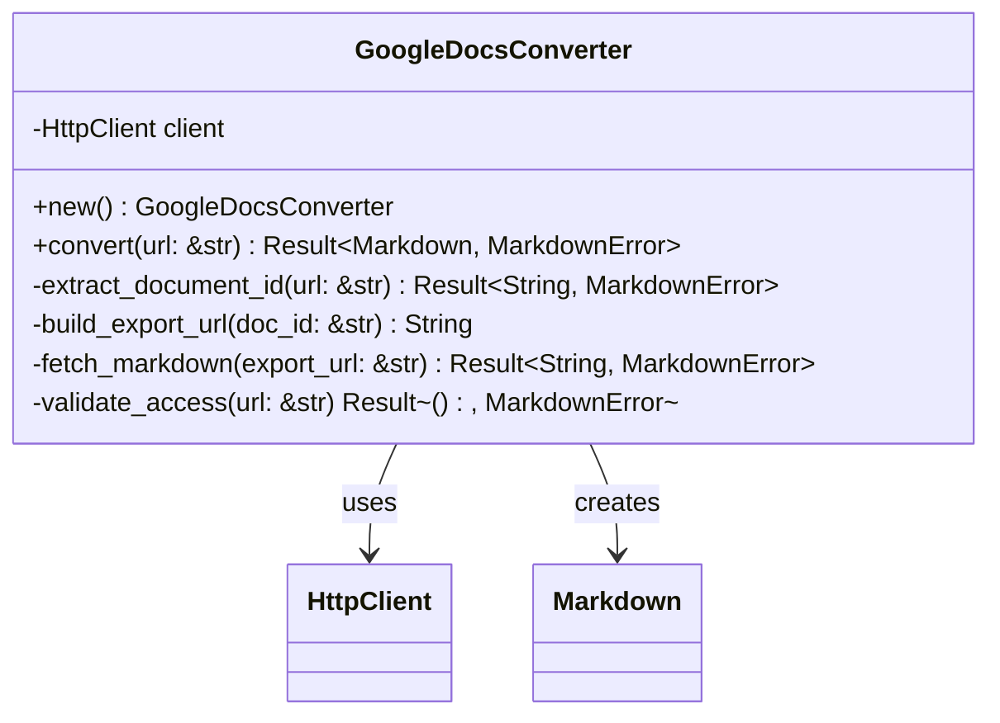

# Google Docs Export Handler

Implement Google Docs URL manipulation and markdown export functionality using Google's export APIs.

## Objectives

- Transform Google Docs URLs to export markdown directly
- Handle various Google Docs URL formats (edit, view, share links)
- Implement proper error handling for private/restricted documents
- Generate high-quality markdown output from Google Docs

## Tasks

1. Create `src/converters/google_docs.rs` module with:
   - `GoogleDocsConverter` struct for Google Docs processing
   - URL transformation logic for export endpoints
   - Authentication handling for public documents

2. Implement URL transformation methods:
   - `extract_document_id(url: &str) -> Result<String, MarkdownError>` - Parse doc ID
   - `build_export_url(doc_id: &str) -> String` - Create export URL
   - `handle_url_variants(url: &str) -> Result<String, MarkdownError>` - Normalize URL formats

3. Add Google Docs URL format support:
   - Edit URLs: `https://docs.google.com/document/d/{id}/edit`
   - View URLs: `https://docs.google.com/document/d/{id}/view`  
   - Share URLs: `https://docs.google.com/document/d/{id}/edit?usp=sharing`
   - Drive URLs: `https://drive.google.com/file/d/{id}/view`

4. Implement `GoogleDocsConverter` methods:
   - `new() -> Self` - Initialize converter
   - `convert(url: &str) -> Result<Markdown, MarkdownError>` - Main conversion
   - `fetch_markdown(export_url: &str) -> Result<String, MarkdownError>` - Fetch content
   - `validate_access(url: &str) -> Result<(), MarkdownError>` - Check permissions

5. Add export format handling:
   - Use Google's markdown export: `/export?format=md`
   - Fallback to plain text if markdown not available
   - Handle HTML export as secondary option
   - Post-process Google's markdown output for quality

6. Error handling for common issues:
   - Private documents (permission denied)
   - Invalid document IDs
   - Network timeouts and rate limiting
   - Export format not available

## Acceptance Criteria

- [ ] All Google Docs URL formats are properly handled
- [ ] Document IDs are correctly extracted from URLs
- [ ] Export URLs are properly constructed
- [ ] Public documents export successfully to markdown
- [ ] Private documents fail gracefully with clear errors
- [ ] Output includes proper YAML frontmatter
- [ ] Unit tests for URL parsing and transformation
- [ ] Integration tests with real Google Docs (public test documents)

## Dependencies

- Previous: [000006_url_detection]
- Requires: HttpClient, FrontmatterBuilder, URL detection

## Architecture Notes

## Google Docs Export API

Google Docs provides several export formats via URL parameters:
- `format=md` - Markdown (preferred)
- `format=txt` - Plain text (fallback)
- `format=html` - HTML (can convert with html2text)

Export URL pattern: `https://docs.google.com/document/d/{id}/export?format=md`

## Test Cases

Include test documents for:
- Public documents with various formatting
- Documents with images and tables
- Documents with complex formatting
- Edge cases: empty documents, very large documents
- Error cases: private documents, invalid IDs

## Known Limitations

- Only works with publicly accessible documents
- Google's markdown export may not preserve complex formatting
- Rate limiting may apply for high-volume usage
- Requires documents to have link sharing enabled