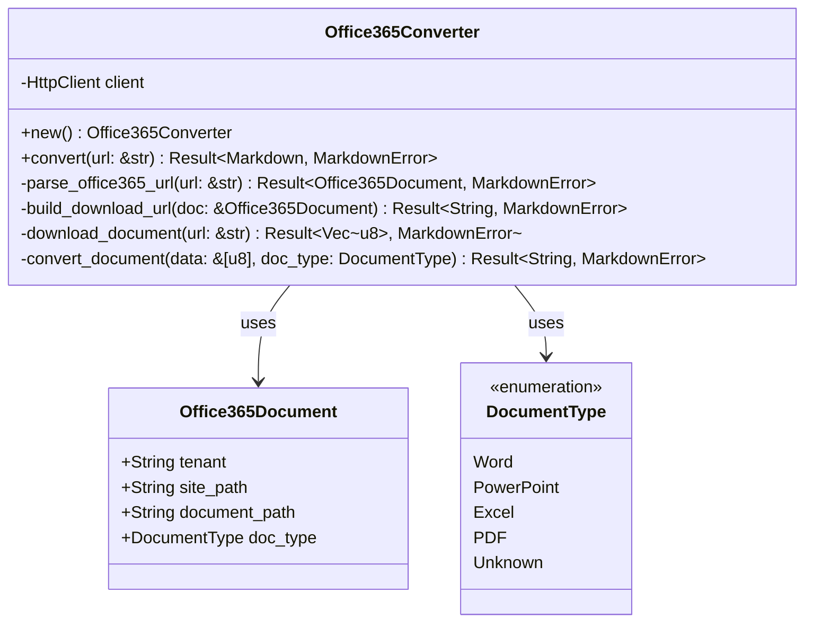

# Office 365 Export Handler

Implement Office 365 document URL manipulation and export functionality for SharePoint and OneDrive documents.

## Objectives

- Handle SharePoint and OneDrive document URLs
- Transform URLs to access downloadable formats
- Support various Office 365 document types (Word, PowerPoint, Excel)
- Convert downloaded documents to markdown format

## Tasks

1. Create `src/converters/office365.rs` module with:
   - `Office365Converter` struct for Office 365 processing
   - URL pattern matching for different Office 365 services
   - Document type detection and format handling

2. Implement URL transformation methods:
   - `parse_office365_url(url: &str) -> Result<Office365Document, MarkdownError>`
   - `build_download_url(doc: &Office365Document) -> Result<String, MarkdownError>`
   - `detect_document_type(url: &str) -> Result<DocumentType, MarkdownError>`

3. Add Office 365 URL format support:
   - SharePoint: `https://{tenant}.sharepoint.com/sites/{site}/...`
   - OneDrive Business: `https://{tenant}-my.sharepoint.com/personal/...`
   - OneDrive Personal: `https://onedrive.live.com/...`
   - Office Online: `https://{tenant}.office.com/...`

4. Create document type handling:
   - Word documents (.docx) - Convert to markdown via pandoc or similar
   - PowerPoint (.pptx) - Extract text content and structure
   - Excel (.xlsx) - Convert tables to markdown tables
   - PDF files - Extract text and convert to markdown

5. Implement `Office365Converter` methods:
   - `new() -> Self` - Initialize converter
   - `convert(url: &str) -> Result<Markdown, MarkdownError>` - Main conversion
   - `download_document(url: &str) -> Result<Vec<u8>, MarkdownError>` - Fetch binary
   - `convert_document(data: &[u8], doc_type: DocumentType) -> Result<String, MarkdownError>`

6. Add document conversion pipeline:
   - Download binary document content
   - Detect format from content headers if needed
   - Convert to markdown using appropriate tool:
     - pandoc for Word documents
     - Custom logic for PowerPoint and Excel
     - Text extraction for PDFs

7. Error handling:
   - Authentication required errors
   - Unsupported document formats
   - Large file handling and timeouts
   - Network errors and retries

## Acceptance Criteria

- [ ] SharePoint and OneDrive URLs are properly parsed
- [ ] Document download URLs are correctly constructed
- [ ] Word documents convert to clean markdown
- [ ] PowerPoint slides are structured appropriately
- [ ] Excel sheets become readable markdown tables
- [ ] Error handling covers authentication and access issues
- [ ] Output includes proper YAML frontmatter with document metadata
- [ ] Unit tests for URL parsing and document type detection
- [ ] Integration tests with sample Office documents

## Dependencies

- Previous: [000007_google_docs_handler]
- Requires: HttpClient, FrontmatterBuilder, URL detection
- External: pandoc or similar document conversion tool

## Architecture Notes

## URL Pattern Examples

| Service | Example URL | Extraction Pattern |
|---------|-------------|-------------------|
| SharePoint | `https://company.sharepoint.com/sites/team/Shared%20Documents/doc.docx` | Extract tenant, site, document path |
| OneDrive Business | `https://company-my.sharepoint.com/personal/user_company_com/Documents/doc.docx` | Extract tenant, user, document path |
| OneDrive Personal | `https://onedrive.live.com/redir?resid=123&authkey=456` | Extract file ID and auth token |

## Document Conversion Tools

- **pandoc** - Universal document converter (Word, PowerPoint to markdown)
- **python-pptx** - PowerPoint processing (if pandoc insufficient)
- **openpyxl** - Excel processing for table extraction
- **PyPDF2** or **pdfplumber** - PDF text extraction

## Test Cases

- Various SharePoint document URLs
- OneDrive personal and business links
- Different document types and formats
- Password-protected and restricted documents
- Large documents and timeout handling
- Invalid URLs and malformed links

## Known Limitations

- Requires documents to be publicly accessible or authentication
- Complex formatting may not convert perfectly to markdown
- Some Office 365 tenants may block external access
- Large documents may timeout during download/conversion