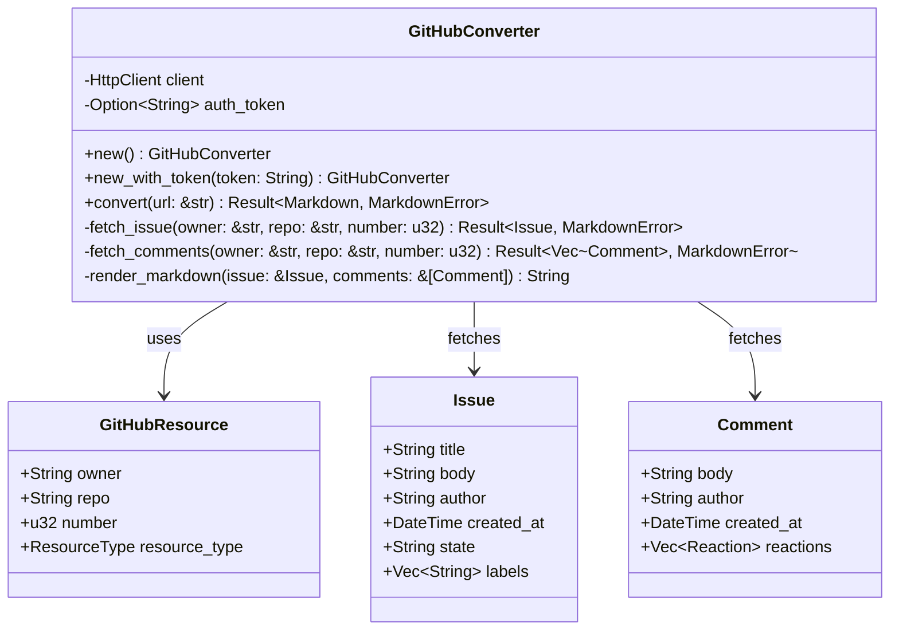

# GitHub Issues Handler

Implement GitHub Issues and Pull Requests integration using the GitHub REST API to fetch issues with comments and render to markdown.

## Objectives

- Fetch GitHub issues and pull requests via REST API
- Include all comments and reactions in the output
- Handle GitHub markdown formatting properly
- Support both public and private repositories (with authentication)

## Tasks

1. Create `src/converters/github.rs` module with:
   - `GitHubConverter` struct for GitHub API integration
   - Issue/PR parsing and URL extraction
   - API authentication handling

2. Implement GitHub URL parsing:
   - `parse_github_url(url: &str) -> Result<GitHubResource, MarkdownError>`
   - Support issues: `https://github.com/{owner}/{repo}/issues/{number}`
   - Support PRs: `https://github.com/{owner}/{repo}/pull/{number}`
   - Extract owner, repository, and issue/PR number

3. Create `GitHubConverter` methods:
   - `new() -> Self` - Initialize with optional auth token
   - `new_with_token(token: String) -> Self` - Initialize with GitHub token
   - `convert(url: &str) -> Result<Markdown, MarkdownError>` - Main conversion
   - `fetch_issue(owner: &str, repo: &str, number: u32) -> Result<Issue, MarkdownError>`
   - `fetch_comments(owner: &str, repo: &str, number: u32) -> Result<Vec<Comment>, MarkdownError>`

4. Add GitHub API integration:
   - Use GitHub REST API v3: `https://api.github.com/repos/{owner}/{repo}/issues/{number}`
   - Handle rate limiting with proper backoff
   - Support authentication via personal access tokens
   - Parse JSON responses into structured data

5. Create GitHub data structures:
   - `GitHubResource` (owner, repo, number, resource_type)
   - `Issue` (title, body, author, created_at, state, labels)
   - `Comment` (body, author, created_at, reactions)
   - `Reaction` (type, count)

6. Implement markdown rendering:
   - Format issue title as main heading
   - Include issue metadata (author, date, state, labels)
   - Render issue body preserving GitHub markdown
   - Include all comments with author and timestamp
   - Add reaction counts where available
   - Preserve code blocks and formatting

7. Error handling:
   - Rate limit exceeded (with retry after)
   - Private repository access denied
   - Issue/PR not found (404)
   - Invalid repository or URL format
   - Network timeouts and API errors

## Acceptance Criteria

- [ ] GitHub issue URLs are correctly parsed
- [ ] Issues and comments are fetched via REST API
- [ ] Rate limiting is handled gracefully
- [ ] Authentication works for private repos
- [ ] Markdown output includes all issue content and comments
- [ ] GitHub markdown formatting is preserved
- [ ] Reactions and metadata are included
- [ ] Error handling covers all API failure modes
- [ ] Unit tests for URL parsing and API response handling
- [ ] Integration tests with real GitHub issues

## Dependencies

- Previous: [000008_office365_handler]
- Requires: HttpClient, FrontmatterBuilder, URL detection
- Add dependency: `serde_json` for API response parsing

## Architecture Notes



## GitHub API Endpoints

- **Issue/PR**: `GET /repos/{owner}/{repo}/issues/{number}`
- **Comments**: `GET /repos/{owner}/{repo}/issues/{number}/comments`
- **Reactions**: `GET /repos/{owner}/{repo}/issues/{number}/reactions`

## Example Output Format

```markdown
---
source_url: "https://github.com/owner/repo/issues/123"
exporter: "github_api"
date_downloaded: "2024-01-15T10:30:00Z"
github_issue_number: 123
github_repository: "owner/repo"
github_state: "open"
---

# Issue Title Here

**Author:** @username  
**Created:** 2024-01-15 10:00:00 UTC  
**State:** Open  
**Labels:** bug, help wanted  

Issue body content here with GitHub markdown formatting preserved.

## Comments

### Comment by @commenter1 (2024-01-15 10:15:00 UTC)

Comment content here.

👍 2 | 👎 1 | 😄 1

### Comment by @commenter2 (2024-01-15 10:30:00 UTC)

Another comment.
```

## Authentication

- Support GitHub personal access tokens via environment variable
- Handle both public and private repository access
- Include proper User-Agent header for API requests
- Implement OAuth flow for more advanced use cases (future enhancement)

## Test Cases

- Public repository issues and PRs
- Private repository access (with token)
- Issues with no comments
- Issues with many comments and reactions
- Rate limiting scenarios
- Invalid URLs and 404 errors
- Closed vs open issues