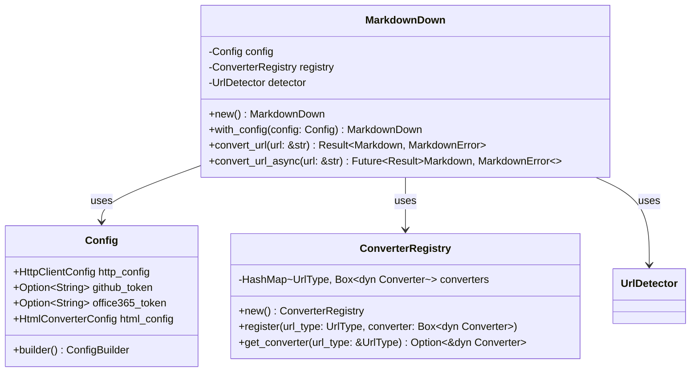

# Unified Public API

Create the main public API that provides a single entry point for converting any supported URL to markdown, routing to appropriate handlers based on URL type detection.

## Objectives

- Provide a simple, unified API: URL in, Markdown out
- Automatically detect URL type and route to appropriate converter
- Handle configuration and authentication for all converters
- Implement proper error handling and user feedback

## Tasks

1. Create `src/lib.rs` main API with:
   - `MarkdownDown` main struct for library usage
   - Public API methods for URL conversion
   - Configuration builder pattern
   - Integration with all converter modules

2. Implement `MarkdownDown` struct:
   - `new() -> Self` - Create with default configuration
   - `with_config(config: Config) -> Self` - Create with custom config
   - `convert_url(url: &str) -> Result<Markdown, MarkdownError>` - Main API method
   - `convert_url_async(url: &str) -> Future<Result<Markdown, MarkdownError>>` - Async version

3. Create `Config` struct for configuration:
   - HTTP client settings (timeout, user agent, retry policy)
   - Authentication tokens (GitHub, Office 365)
   - Converter-specific options
   - Builder pattern for easy configuration

4. Add convenience functions:
   - `convert_url(url: &str) -> Result<Markdown, MarkdownError>` - Simple function API
   - `convert_url_with_config(url: &str, config: Config) -> Result<Markdown, MarkdownError>`
   - `detect_url_type(url: &str) -> Result<UrlType, MarkdownError>` - Utility function

5. Implement routing logic:
   - Use `UrlDetector` to determine URL type
   - Route to appropriate converter based on type
   - Handle fallbacks (e.g., HTML conversion for unknown types)
   - Aggregate errors from different converters

6. Create `ConverterRegistry`:
   - Registry of all available converters
   - Dynamic registration of converter types
   - Allow custom converters to be added
   - Handle converter initialization and configuration

7. Add comprehensive error handling:
   - Map all converter-specific errors to unified error types
   - Provide detailed error messages with suggested fixes
   - Include URL and converter information in error context
   - Support error chaining for debugging

## Acceptance Criteria

- [ ] Single method call converts any supported URL to markdown
- [ ] URL type detection works automatically
- [ ] All converters are properly integrated and routed
- [ ] Configuration is flexible and well-documented  
- [ ] Error messages are clear and actionable
- [ ] Both sync and async APIs are available
- [ ] Unit tests cover all routing scenarios
- [ ] Integration tests with real URLs of each type
- [ ] API documentation is complete and includes examples

## Dependencies

- Previous: [000009_github_issues_handler]
- Requires: All converter modules, UrlDetector, Config system

## Architecture Notes



## Public API Examples

### Simple Usage
```rust
use markdowndown::convert_url;

let markdown = convert_url("https://example.com/article.html")?;
println!("{}", markdown);
```

### With Configuration
```rust
use markdowndown::{MarkdownDown, Config};

let config = Config::builder()
    .github_token("ghp_xxxxxxxxxxxx")
    .timeout_seconds(60)
    .build();

let md = MarkdownDown::with_config(config);
let result = md.convert_url("https://github.com/owner/repo/issues/123")?;
```

### Async Usage
```rust
use markdowndown::MarkdownDown;

let md = MarkdownDown::new();
let result = md.convert_url_async("https://docs.google.com/document/d/abc123/edit").await?;
```

## Configuration Options

- **HTTP Settings**: timeout, user agent, proxy, retry policy
- **Authentication**: GitHub personal access token, Office 365 credentials
- **Converter Options**: HTML cleanup rules, markdown formatting preferences
- **Output Options**: include/exclude frontmatter, custom frontmatter fields

## Error Handling Strategy

1. **URL Validation Errors**: Invalid format, unsupported scheme
2. **Network Errors**: Timeout, connection failed, DNS resolution
3. **Authentication Errors**: Missing token, invalid credentials, permission denied
4. **Content Errors**: Empty content, malformed HTML, unsupported format
5. **Converter Errors**: Processing failed, external tool not available

Each error type includes:
- Clear description of what went wrong
- Suggested fixes or next steps
- Context about which URL and converter was involved
- Original error cause (when available)

## Test Cases

- Each URL type with valid URLs
- Error scenarios for each converter
- Configuration edge cases
- Network failure simulation
- Authentication failure handling
- Large document processing
- Concurrent request handling