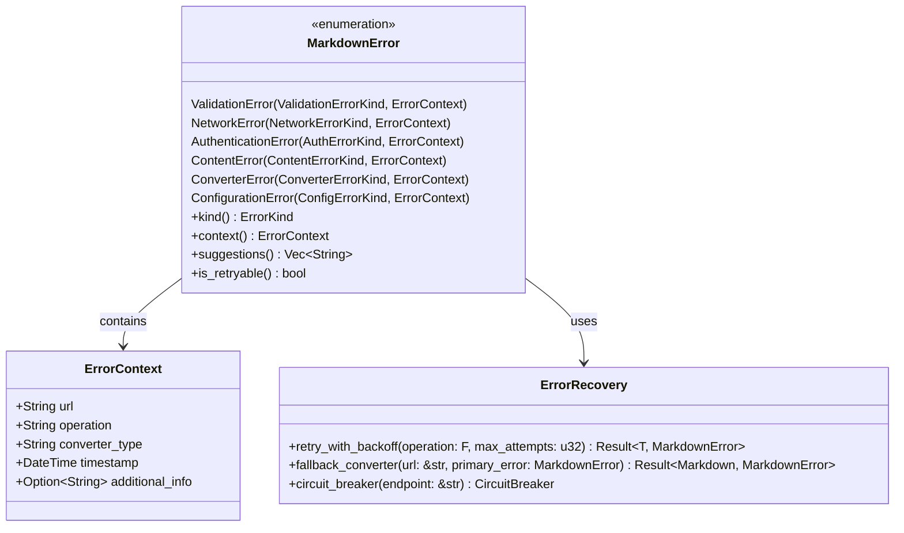

# Comprehensive Error Handling

Implement robust error handling across all components with clear, actionable error messages and proper error recovery strategies.

## Objectives

- Create a unified error handling system across all modules
- Provide clear, actionable error messages for users
- Implement proper error recovery and fallback strategies
- Add comprehensive logging for debugging and monitoring

## Tasks

1. Enhance `MarkdownError` enum in `src/types.rs`:
   - Add detailed error variants for each failure mode
   - Include error context (URL, converter type, operation)
   - Implement error chaining with `source()` method
   - Add helper methods for error categorization

2. Create error categories:
   - **ValidationError**: Invalid URLs, malformed input
   - **NetworkError**: Connection failures, timeouts, DNS issues
   - **AuthenticationError**: Missing/invalid tokens, permission denied
   - **ContentError**: Empty content, unsupported formats, parsing failures
   - **ConverterError**: External tool failures, processing errors
   - **ConfigurationError**: Invalid config values, missing dependencies

3. Implement error context:
   - `ErrorContext` struct with URL, operation, timestamp
   - Add context to all error creation points
   - Include suggestions for error resolution
   - Provide error codes for programmatic handling

4. Add error recovery strategies:
   - Automatic retry with exponential backoff for transient errors
   - Fallback converters (e.g., HTML conversion for failed specific converters)
   - Graceful degradation for non-critical failures
   - Circuit breaker pattern for repeated failures

5. Create logging integration:
   - Use `tracing` crate for structured logging
   - Log errors with appropriate levels (warn/error)
   - Include context information in log messages
   - Support custom log targets for different error types

6. Implement error aggregation:
   - Collect multiple errors when appropriate
   - Provide detailed error reports for batch operations
   - Include partial success information
   - Support error filtering and categorization

7. Add user-friendly error messages:
   - Clear descriptions of what went wrong
   - Specific suggestions for resolution
   - Links to documentation where appropriate
   - Examples of correct usage when relevant

## Acceptance Criteria

- [ ] All error paths have clear, actionable messages
- [ ] Error context includes relevant debugging information
- [ ] Retry logic works for transient failures
- [ ] Fallback strategies are implemented where appropriate
- [ ] Logging provides sufficient detail for troubleshooting
- [ ] Error handling is consistent across all modules
- [ ] Unit tests cover all error scenarios
- [ ] Error message quality is validated with user testing

## Dependencies

- Previous: [000010_unified_api]
- Requires: Core types, all converter modules
- Add dependency: `tracing` for structured logging

## Architecture Notes



## Error Message Examples

### Validation Error
```
Error: Invalid Google Docs URL format

URL: https://docs.google.com/invalid-path
Operation: URL detection
Converter: GoogleDocsConverter

The provided URL does not match the expected Google Docs format.

Suggestions:
  • Ensure the URL contains '/document/d/{document-id}/'
  • Try using the full URL from your browser address bar
  • Check that the document is publicly accessible

Expected format: https://docs.google.com/document/d/{document-id}/edit
```

### Network Error
```
Error: Failed to fetch document content

URL: https://docs.google.com/document/d/abc123/export?format=md
Operation: Document download
Converter: GoogleDocsConverter
Cause: Connection timeout after 30 seconds

Suggestions:
  • Check your internet connection
  • The document server may be experiencing issues
  • Try again in a few minutes
  • Consider increasing the timeout in configuration
```

### Authentication Error
```
Error: GitHub API access denied

URL: https://github.com/private/repo/issues/123
Operation: Fetch issue
Converter: GitHubConverter

The GitHub API returned a 403 Forbidden error, indicating insufficient permissions.

Suggestions:
  • Ensure you have a valid GitHub personal access token configured
  • Check that the token has 'repo' scope for private repositories
  • Verify that you have access to the repository
  • Set token via: Config::builder().github_token("your-token").build()

Documentation: https://docs.github.com/en/authentication/keeping-your-account-and-data-secure/creating-a-personal-access-token
```

## Error Recovery Strategies

### Retry Logic
- **Transient network errors**: 3 attempts with exponential backoff
- **Rate limiting**: Respect retry-after headers
- **DNS resolution failures**: Retry with different DNS servers

### Fallback Converters
- **Google Docs failure**: Fall back to HTML conversion via public URL
- **Office 365 failure**: Attempt HTML extraction if direct download fails
- **GitHub API failure**: Fall back to web scraping (limited functionality)

### Graceful Degradation
- **Missing metadata**: Continue with partial information
- **Image download failures**: Include image URLs in markdown
- **Formatting issues**: Preserve content even if formatting is imperfect

## Logging Strategy

```rust
use tracing::{error, warn, info, debug};

// Error logging with context
error!(
    url = %context.url,
    operation = %context.operation,
    converter = %context.converter_type,
    error = %error,
    "Failed to convert URL"
);

// Warning for recoverable issues
warn!(
    url = %url,
    "Falling back to HTML conversion after primary converter failed"
);

// Info for successful operations
info!(
    url = %url,
    converter = %converter_type,
    content_length = content.len(),
    "Successfully converted URL to markdown"
);
```

## Test Cases

- Network timeout simulation
- Invalid authentication token handling
- Malformed URL processing
- Server error responses (4xx, 5xx)
- Content parsing failures
- Configuration validation
- Retry logic verification
- Fallback strategy testing
- Error message quality validation