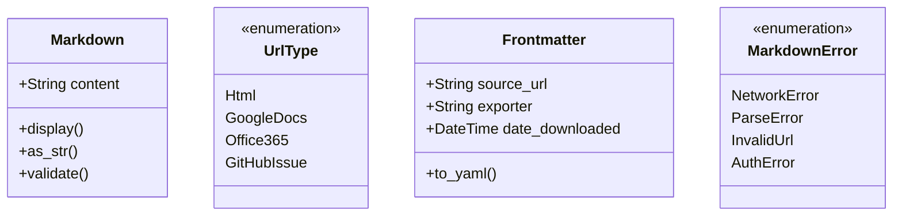

# Core Types and Data Structures

Define the fundamental types and data structures that will be used throughout the library.

## Objectives

- Create a `Markdown` newtype with comprehensive functionality
- Define URL type enumeration for different URL sources
- Create error types for proper error handling
- Establish frontmatter structure for metadata

## Tasks

1. Create `src/types.rs` module with:
   - `Markdown` newtype wrapping `String` with:
     - Display trait implementation
     - From/Into conversions
     - Validation methods
     - Content access methods
   
2. Create `UrlType` enum for different URL sources:
   - `Html` - Generic HTML pages
   - `GoogleDocs` - Google Docs documents  
   - `Office365` - Office 365 documents
   - `GitHubIssue` - GitHub issues

3. Create `MarkdownError` enum for error handling:
   - Network errors
   - Parsing errors  
   - Invalid URL errors
   - Authentication errors

4. Create `Frontmatter` struct with:
   - `source_url: String`
   - `exporter: String` 
   - `date_downloaded: DateTime<Utc>`
   - Serialization support for YAML

## Acceptance Criteria

- [ ] All types compile without warnings
- [ ] `Markdown` newtype has comprehensive API
- [ ] Error types cover all expected failure modes
- [ ] Frontmatter serializes correctly to YAML
- [ ] Unit tests for all type conversions and methods

## Dependencies

- Previous: [000001_project_setup]
- Add dependencies: `serde`, `chrono`, `serde_yaml`

## Architecture Notes

## Proposed Solution

I will implement the core types following these steps:

1. **Add Required Dependencies**: Update `Cargo.toml` to include `serde`, `chrono`, and `serde_yaml` with appropriate feature flags.

2. **Create `src/types.rs`** with the following structure:
   - `Markdown` newtype with validation, display, and conversion methods
   - `UrlType` enum with variants for different URL sources
   - `MarkdownError` enum using `thiserror` for ergonomic error handling
   - `Frontmatter` struct with serde serialization support

3. **Implementation Details**:
   - Use `thiserror` for error handling to get automatic `Error` trait implementations
   - Implement `Display`, `From`, `Into`, `AsRef`, and `Deref` traits for `Markdown`
   - Add validation method to check for empty/whitespace-only content
   - Use `chrono::DateTime<Utc>` with serde support for timestamps
   - Implement `Serialize`/`Deserialize` for `Frontmatter` with YAML support

4. **Testing Strategy**: Create comprehensive unit tests covering:
   - Type conversions and trait implementations
   - Error handling and error message formatting
   - Frontmatter YAML serialization/deserialization
   - Markdown validation edge cases

This follows the coding standards by using the type system effectively, avoiding primitive types for domain concepts, and providing comprehensive error handling.