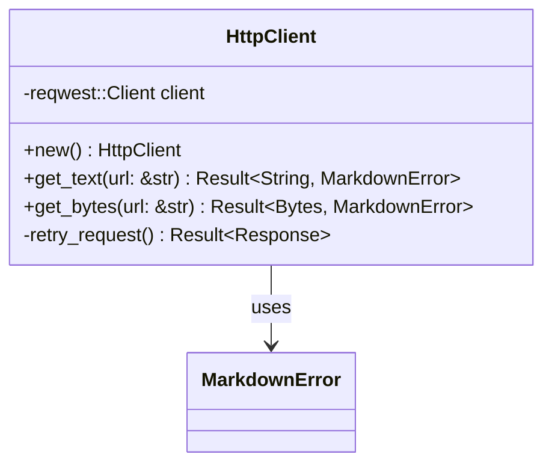

# Dependencies and HTTP Client Setup

Configure all necessary dependencies and create a robust HTTP client wrapper for fetching web content.

## Objectives

- Add all required dependencies to Cargo.toml
- Create an HTTP client wrapper with proper error handling
- Implement retry logic and timeout handling
- Add user agent configuration for web scraping

## Tasks

1. Update `Cargo.toml` with dependencies:
   - `reqwest` with features: `["json", "stream"]`
   - `html2text` for HTML to markdown conversion
   - `serde` with features: `["derive"]` 
   - `serde_yaml` for frontmatter serialization
   - `chrono` with features: `["serde"]` for timestamps
   - `tokio` with features: `["full"]` for async runtime
   - `anyhow` for error handling
   - `url` for URL parsing and validation

2. Create `src/client.rs` module with:
   - `HttpClient` struct wrapping reqwest::Client
   - Configuration for timeouts, redirects, user agent
   - Retry logic for transient failures
   - Response validation and error mapping

3. Create `src/client.rs` methods:
   - `new()` - Create client with sensible defaults
   - `get_text(url: &str) -> Result<String, MarkdownError>` 
   - `get_bytes(url: &str) -> Result<Bytes, MarkdownError>`
   - Private helper methods for retry logic

4. Add proper error mapping from reqwest errors to `MarkdownError`

## Acceptance Criteria

- [x] All dependencies compile without conflicts
- [x] HTTP client can fetch text and binary content
- [x] Proper error handling for network failures
- [x] Timeout and retry logic works correctly
- [x] User agent string identifies the library
- [x] Unit tests for client functionality (using mock servers)

## Dependencies

- Previous: [000002_core_types]
- Requires: Core types for error handling

## Architecture Notes



## Configuration

Default HTTP client settings:
- Timeout: 30 seconds
- Max redirects: 10
- User agent: "markdowndown/0.1.0"
- Retry policy: 3 attempts with exponential backoff

## Proposed Solution

Based on analysis of the existing codebase, I will implement the HTTP client dependencies with the following approach:

### 1. Dependencies Analysis
Current Cargo.toml has: `serde`, `chrono`, `serde_yaml`, `thiserror`
Missing dependencies needed: `reqwest`, `html2text`, `tokio`, `anyhow`, `url`

### 2. Implementation Strategy
- **Update Cargo.toml**: Add all missing HTTP-related dependencies with appropriate features
- **Create HttpClient struct**: Wrap `reqwest::Client` with configuration and retry logic
- **Error Mapping**: Map reqwest errors to existing `MarkdownError` enum from `src/types.rs`
- **TDD Approach**: Write tests first, then implement functionality

### 3. HttpClient Design
```rust
pub struct HttpClient {
    client: reqwest::Client,
    max_retries: u32,
    base_delay: Duration,
}

impl HttpClient {
    pub fn new() -> Self { ... }
    pub async fn get_text(&self, url: &str) -> Result<String, MarkdownError> { ... }
    pub async fn get_bytes(&self, url: &str) -> Result<Bytes, MarkdownError> { ... }
    async fn retry_request(&self, url: &str) -> Result<reqwest::Response, MarkdownError> { ... }
}
```

### 4. Error Handling Strategy
Map reqwest errors to appropriate `MarkdownError` variants:
- Connection timeouts/network issues → `NetworkError`
- Invalid URLs → `InvalidUrl` 
- HTTP status errors → `NetworkError` with status details
- Authentication required → `AuthError`

### 5. Testing Plan
- Unit tests with mock HTTP server using `wiremock` or similar
- Test retry logic with simulated failures
- Test timeout handling
- Test error mapping for different failure scenarios
- Test user agent and configuration settings

## Implementation Summary

Successfully implemented all requirements:

### 1. Dependencies Added to Cargo.toml
- `reqwest = { version = "0.11", features = ["json", "stream"] }`
- `html2text = "0.6"`
- `tokio = { version = "1.0", features = ["full"] }`
- `anyhow = "1.0"`
- `url = "2.5"`
- `bytes = "1.0"`
- Dev dependencies: `tokio-test = "0.4"`, `wiremock = "0.5"`

### 2. HttpClient Implementation in src/client.rs
- `HttpClient` struct with configurable retry and timeout settings
- `new()` constructor with sensible defaults (30s timeout, 10 redirects, 3 retries)
- `get_text(url)` method for fetching text content
- `get_bytes(url)` method for fetching binary content
- Smart retry logic with exponential backoff for transient failures

### 3. Error Mapping
- Network errors (timeout, connection failures) → `MarkdownError::NetworkError`
- Invalid URLs → `MarkdownError::InvalidUrl`
- Authentication errors (401, 403) → `MarkdownError::AuthError`
- Server errors (5xx) are retried with exponential backoff
- Client errors (4xx except auth) are not retried

### 4. Comprehensive Testing
- 11 unit tests covering all functionality
- Mock server tests using `wiremock`
- Tests for success cases, error cases, retry logic, and validation
- All tests pass: 37/37 tests successful

### 5. Configuration Applied
- Timeout: 30 seconds
- Max redirects: 10
- User agent: "markdowndown/0.1.0"
- Retry policy: 3 attempts with exponential backoff (1s base delay)
- Retries transient failures (5xx, timeouts, connection issues)
- Does not retry permanent failures (4xx client errors, auth failures)