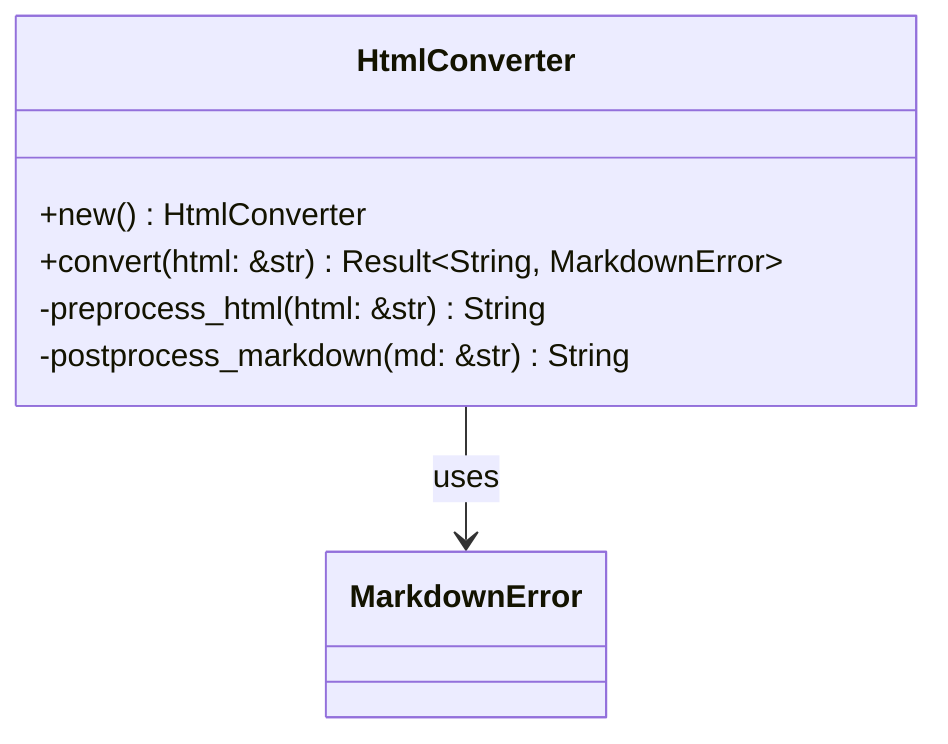

# HTML to Markdown Conversion

Implement robust HTML to markdown conversion using html2text with proper formatting and cleanup.

## Objectives

- Create HTML to markdown conversion functionality
- Handle common HTML elements properly
- Clean up and format output for LLM consumption
- Preserve important formatting while removing clutter

## Tasks

1. Create `src/converters/html.rs` module with:
   - `HtmlConverter` struct for HTML processing
   - Configuration options for conversion behavior
   - Methods for cleaning and preprocessing HTML

2. Implement `HtmlConverter` methods:
   - `new() -> Self` - Create converter with default settings
   - `convert(html: &str) -> Result<String, MarkdownError>` - Main conversion
   - `preprocess_html(html: &str) -> String` - Clean HTML before conversion
   - `postprocess_markdown(md: &str) -> String` - Clean markdown after conversion

3. Add HTML preprocessing:
   - Remove script and style tags
   - Clean up navigation elements
   - Remove ads and sidebars (common CSS classes)
   - Preserve main content structure

4. Add markdown postprocessing:
   - Normalize whitespace
   - Remove excessive blank lines
   - Clean up malformed links
   - Ensure proper heading hierarchy

5. Create `src/converters/mod.rs` to expose converter modules

## Acceptance Criteria

- [ ] HTML converts to clean, readable markdown
- [ ] Navigation and ads are properly filtered out
- [ ] Links and images are preserved correctly  
- [ ] Heading structure is maintained
- [ ] Excessive whitespace is cleaned up
- [ ] Unit tests with various HTML samples
- [ ] Integration tests with real web pages

## Dependencies

- Previous: [000003_dependencies_setup]
- Requires: HTTP client for fetching HTML content

## Architecture Notes

## Processing Pipeline

1. **Fetch HTML** → HTTP client retrieves page content
2. **Preprocess** → Remove unwanted elements, clean structure  
3. **Convert** → html2text transforms to markdown
4. **Postprocess** → Clean up markdown formatting
5. **Validate** → Ensure output quality

## Test Cases

Include test cases for:
- Basic HTML elements (headings, paragraphs, lists)
- Complex layouts with navigation/sidebars
- Pages with embedded media
- Malformed HTML handling

## Proposed Solution

I will implement the HTML to Markdown conversion functionality following the Test Driven Development (TDD) approach:

### Implementation Plan

1. **Create Module Structure**
   - Create `src/converters/mod.rs` to organize all converter modules
   - Create `src/converters/html.rs` with the `HtmlConverter` struct

2. **HtmlConverter Design**
   - Struct will contain configuration options for conversion behavior
   - Use the `html2text` crate for core HTML-to-markdown conversion
   - Implement preprocessing and postprocessing pipeline

3. **Methods Implementation**
   - `new() -> Self` - Creates converter with sensible defaults
   - `convert(html: &str) -> Result<String, MarkdownError>` - Main conversion pipeline
   - `preprocess_html(html: &str) -> String` - Clean HTML before conversion
   - `postprocess_markdown(md: &str) -> String` - Clean markdown after conversion

4. **HTML Preprocessing**
   - Remove `<script>` and `<style>` tags and their content
   - Remove navigation elements (`<nav>`, elements with `nav` class)
   - Remove sidebar elements (elements with `sidebar`, `side-bar` classes)
   - Remove advertisement elements (elements with `ad`, `ads`, `advertisement` classes)
   - Preserve main content structure

5. **Markdown Postprocessing**
   - Normalize whitespace (convert multiple spaces to single space)
   - Remove excessive blank lines (more than 2 consecutive)
   - Clean up malformed links and ensure proper link format
   - Ensure proper heading hierarchy (no skipped levels)

6. **Testing Strategy (TDD)**
   - Write failing tests for each method before implementation
   - Test with various HTML samples including edge cases
   - Include integration tests with real-world HTML examples
   - Verify that unwanted elements are properly filtered

7. **Integration**
   - Update `lib.rs` to expose the converters module
   - Ensure compatibility with existing types and error handling

### Technical Details

- **Dependencies**: Utilize existing `html2text` crate from Cargo.toml
- **Error Handling**: Use existing `MarkdownError` types from `types.rs`
- **Code Style**: Follow existing patterns from `client.rs` and `types.rs`
- **Testing**: Use existing test patterns and wiremock for integration tests