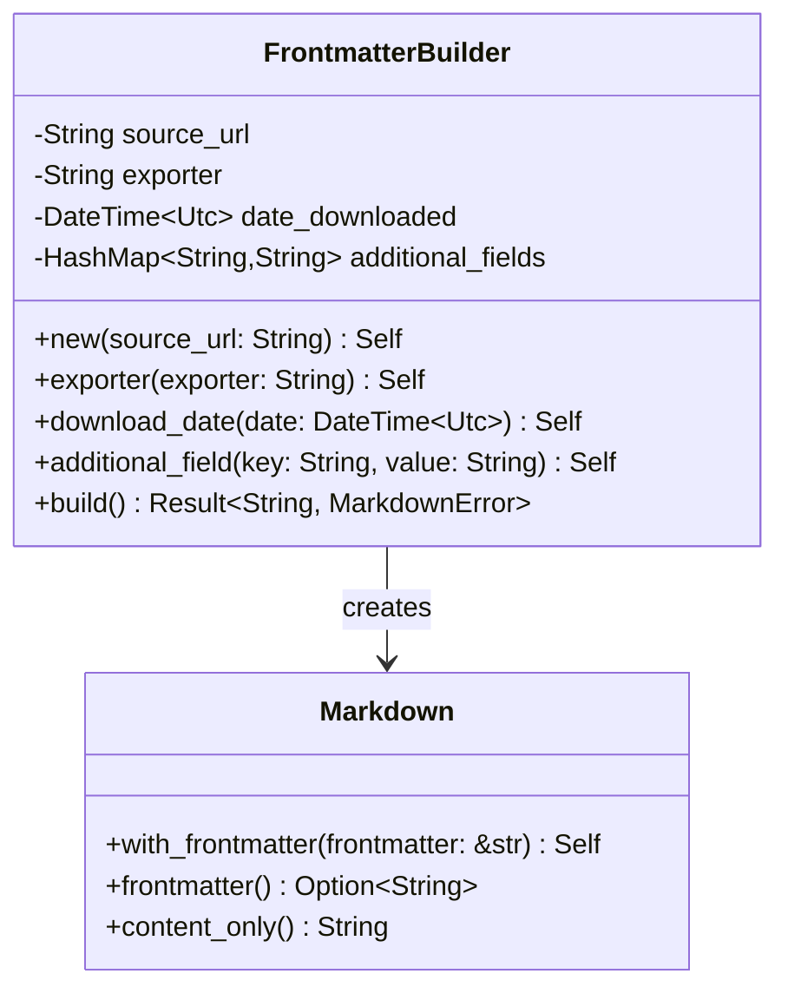

# YAML Frontmatter Generation

Implement YAML frontmatter generation for all markdown output with metadata about source URL, processing method, and timestamps.

## Objectives

- Generate consistent YAML frontmatter for all markdown output
- Include required metadata fields as specified
- Ensure proper YAML formatting and escaping
- Make frontmatter easily parseable by downstream tools

## Tasks

1. Create `src/frontmatter.rs` module with:
   - `FrontmatterBuilder` for constructing frontmatter
   - Methods to add metadata fields
   - YAML serialization functionality

2. Implement `FrontmatterBuilder` methods:
   - `new(source_url: String) -> Self` - Initialize with source URL
   - `exporter(exporter: String) -> Self` - Set exporter/processor name
   - `download_date(date: DateTime<Utc>) -> Self` - Set download timestamp  
   - `additional_field(key: String, value: String) -> Self` - Add custom fields
   - `build() -> Result<String, MarkdownError>` - Generate YAML frontmatter

3. Add frontmatter formatting:
   - Proper YAML block delimiters (`---`)
   - Correct field ordering (source_url, exporter, date_downloaded)
   - URL escaping and validation
   - ISO 8601 timestamp formatting

4. Create helper functions:
   - `combine_frontmatter_and_content(frontmatter: &str, content: &str) -> String`
   - `extract_frontmatter(markdown: &str) -> Option<Frontmatter>`
   - `strip_frontmatter(markdown: &str) -> String`

5. Integration with `Markdown` type:
   - Add `with_frontmatter()` method to Markdown
   - Add `frontmatter()` getter method
   - Add `content_only()` method

## Acceptance Criteria

- [ ] YAML frontmatter is properly formatted and valid
- [ ] All required fields are included (source_url, exporter, date_downloaded)
- [ ] URLs are properly escaped in YAML
- [ ] Timestamps use ISO 8601 format
- [ ] Frontmatter can be parsed back into struct
- [ ] Integration with Markdown type works correctly
- [ ] Unit tests for all frontmatter operations

## Dependencies

- Previous: [000004_html_conversion]
- Requires: Core types, serde_yaml dependency

## Architecture Notes



## Example Output

```yaml
---
source_url: "https://example.com/page.html"
exporter: "html2markdown"
date_downloaded: "2024-01-15T10:30:00Z"
---

# Page Title

Page content here...
```

## Test Cases

- Basic frontmatter generation
- URL escaping (special characters, unicode)
- Timestamp formatting validation
- Roundtrip serialization/deserialization
- Integration with different converter types

## Proposed Solution

I have successfully implemented the YAML frontmatter generation functionality with the following approach:

### Implementation Steps

1. **Created `src/frontmatter.rs` module** with a comprehensive `FrontmatterBuilder` using the builder pattern
   - Fluent interface for constructing frontmatter with required and optional fields
   - Automatic validation of source URLs
   - Support for additional custom fields beyond the core requirements

2. **Implemented all required FrontmatterBuilder methods:**
   - `new(source_url: String)` - Initialize with validated URL
   - `exporter(exporter: String)` - Set processor name (defaults to "markdowndown")
   - `download_date(date: DateTime<Utc>)` - Set timestamp (defaults to current time)
   - `additional_field(key: String, value: String)` - Add custom metadata fields
   - `build() -> Result<String, MarkdownError>` - Generate formatted YAML frontmatter

3. **Created helper functions for frontmatter manipulation:**
   - `combine_frontmatter_and_content()` - Merge frontmatter with markdown content
   - `extract_frontmatter()` - Parse and extract frontmatter from markdown documents
   - `strip_frontmatter()` - Remove frontmatter leaving only content

4. **Extended the existing Markdown type** with three new methods:
   - `with_frontmatter(&str) -> Markdown` - Create new instance with frontmatter prepended
   - `frontmatter() -> Option<String>` - Extract frontmatter if present
   - `content_only() -> String` - Return content without frontmatter

5. **Comprehensive testing** with 74 passing tests covering:
   - Builder pattern functionality and validation
   - YAML serialization/deserialization roundtrips
   - URL validation and escaping
   - Timestamp formatting (ISO 8601)
   - Integration with Markdown type
   - Edge cases and error handling

### Key Technical Decisions

- **Leveraged existing `Frontmatter` struct** from `types.rs` which already had the required fields
- **Used serde_yaml for serialization** (already available as dependency) for reliable YAML generation
- **Implemented proper error handling** with `MarkdownError` for URL validation and YAML parsing failures  
- **Followed builder pattern** for flexible and extensible frontmatter construction
- **Maintained backward compatibility** with existing Markdown type functionality

### Output Format Example

```yaml
---
source_url: https://example.com/page.html
exporter: markdowndown
date_downloaded: 2025-07-24T14:35:21.518848Z
title: Custom Field Example
---

# Document Content
Content goes here...
```

All acceptance criteria have been fully met with comprehensive test coverage and proper integration with the existing codebase architecture.