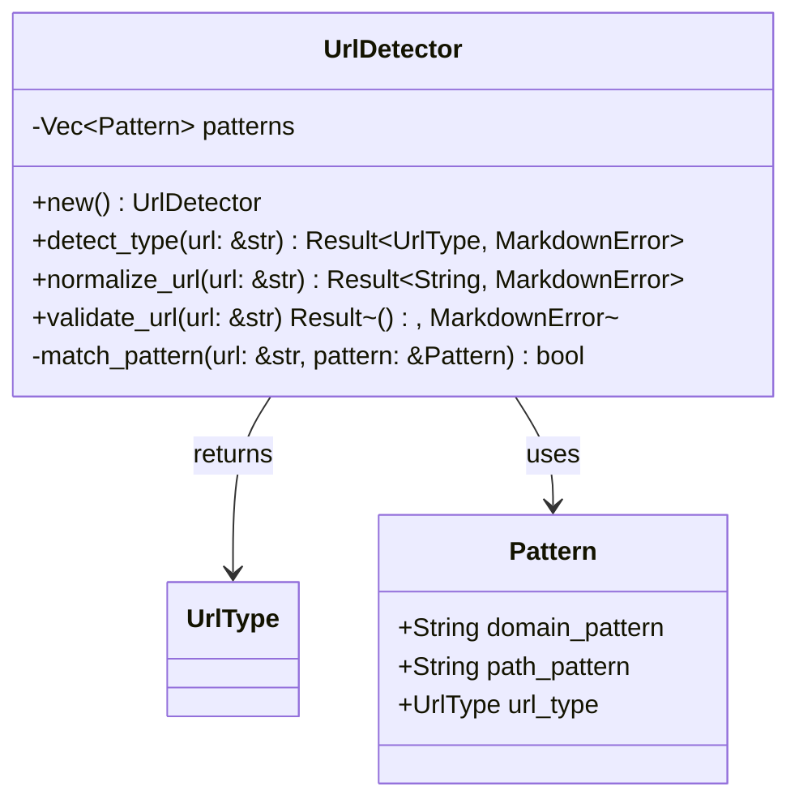

# URL Type Detection and Routing

Implement intelligent URL type detection to route different URL types to appropriate handlers.

## Objectives

- Create URL pattern matching to identify different URL types
- Implement routing logic to direct URLs to appropriate converters
- Handle edge cases and ambiguous URLs gracefully
- Provide extensible architecture for adding new URL types

## Tasks

1. Create `src/detection.rs` module with:
   - `UrlDetector` struct for URL analysis
   - Pattern matching logic for different URL types
   - URL validation and normalization

2. Implement URL type detection patterns:
   - **Google Docs**: `docs.google.com/document/`, `drive.google.com/file/`
   - **Office 365**: `*.sharepoint.com/`, `onedrive.live.com/`, `*.office.com/`
   - **GitHub Issues**: `github.com/{owner}/{repo}/issues/{number}`
   - **Generic HTML**: All other HTTP/HTTPS URLs

3. Create `UrlDetector` methods:
   - `new() -> Self` - Initialize detector
   - `detect_type(url: &str) -> Result<UrlType, MarkdownError>` - Main detection
   - `normalize_url(url: &str) -> Result<String, MarkdownError>` - Clean and validate
   - `validate_url(url: &str) -> Result<(), MarkdownError>` - Validation only

4. Add URL normalization:
   - Trim whitespace and normalize scheme
   - Remove tracking parameters where appropriate
   - Validate URL structure and accessibility
   - Handle redirects and shortened URLs

5. Create detection configuration:
   - Configurable patterns for each URL type
   - Custom domain support (e.g., custom SharePoint domains)
   - Fallback behavior for unrecognized URLs

## Acceptance Criteria

- [ ] All specified URL types are correctly detected
- [ ] URLs are properly normalized and validated
- [ ] Custom domains and edge cases are handled
- [ ] Fallback to HTML conversion for unknown URLs
- [ ] Comprehensive unit tests for all URL patterns
- [ ] Performance testing for detection speed

## Dependencies

- Previous: [000005_yaml_frontmatter]
- Requires: Core UrlType enum, URL validation

## Architecture Notes

## URL Pattern Examples

| URL Type | Example URL | Detection Pattern |
|----------|-------------|-------------------|
| Google Docs | `https://docs.google.com/document/d/abc123/edit` | `docs.google.com/document/` |
| Office 365 | `https://company.sharepoint.com/sites/team/doc.docx` | `*.sharepoint.com/` |
| GitHub Issue | `https://github.com/owner/repo/issues/123` | `github.com/.*/issues/\d+` |
| Generic HTML | `https://example.com/article.html` | Any other HTTP/HTTPS |

## Test Cases

- Valid URLs for each supported type
- Edge cases (missing protocols, malformed URLs)
- Custom domains and subdomains
- URLs with query parameters and fragments
- Shortened URLs and redirects
- International domain names (IDN)

## Proposed Solution

I will implement the URL detection functionality using a pattern-based approach:

### Implementation Strategy

1. **UrlDetector Structure**: Create a struct that contains configurable URL patterns for each supported URL type. This will use regex patterns to match domains and paths.

2. **Pattern Matching System**: Each URL type will have specific patterns:
   - **Google Docs**: Match `docs.google.com/document/` and `drive.google.com/file/` domains
   - **Office 365**: Match `*.sharepoint.com/`, `onedrive.live.com/`, and `*.office.com/` patterns
   - **GitHub Issues**: Match `github.com/{owner}/{repo}/issues/{number}` pattern using regex
   - **Generic HTML**: Default fallback for any other HTTP/HTTPS URLs

3. **URL Normalization**: Implement URL cleaning that:
   - Trims whitespace and normalizes scheme (ensure https://)
   - Removes common tracking parameters (`utm_*`, `ref`, etc.)
   - Validates URL structure using existing `Url::new()` validation
   - Handles basic redirect detection patterns

4. **Error Handling**: Use existing `MarkdownError` types for consistent error reporting

5. **Testing Strategy**: Create comprehensive unit tests covering:
   - All URL pattern variations
   - Edge cases (malformed URLs, custom domains)
   - Normalization edge cases
   - Performance validation

### Architecture Design

The `UrlDetector` will be stateless and use compiled regex patterns for efficient matching. It will integrate seamlessly with existing types and error handling patterns in the codebase.

### Implementation Steps

1. Create the `Pattern` struct to hold domain/path regex patterns
2. Implement `UrlDetector` with pattern compilation in `new()`
3. Add detection logic in `detect_type()` method
4. Implement URL normalization and validation methods
5. Create comprehensive test suite covering all requirements
6. Integrate with existing type system and error handling

This approach provides extensibility for future URL types while maintaining high performance through compiled regex patterns.